# ETHOS.md — The Kineti OS Master Specification (v0.1)

This document is the **Single Source of Truth (`ETHOS.md`)** for all software building operations within **The Kineti OS (v0.1)**. It merges the **Causality System**, **gstack Builder Ethos**, and the **Master Specification** using **pure, non-academic Plain English** with zero technical jargon.

---

## Part 1: Core Governing Execution Directives

1. **Transmit Information Using Pure, Non-Academic Plain English**: Remove technical jargon, abstract metaphors, decorative language, and indirect definitions. Describe every process, structure, or rule as clear physical actions and logical steps. Use simple, concrete words so any non-technical reader or team can immediately build, act on, or apply the logic without interpretation.
2. **Check Initial Facts Match Real-World Conditions**: Check that your initial facts match real-world conditions before spending money, time, or effort. If the facts are wrong, the result will fail. Record any errors and correct the initial criteria.
3. **Expect Conditions to Change at Any Time**: Expect conditions to change at any time. Treat unexpected changes as new data and adjust work so operations continue without stopping.
4. **Remove Extra Steps, Delays, and Obstacles**: Remove extra steps, delays, and obstacles from work processes. Speed increases automatically when delays and unnecessary steps are eliminated.
5. **Build and Keep Long-Lasting Low-Decay Assets ($\lambda < 0.1$)**: Build and keep only code, materials, and tools that remain useful for a long time and do not become obsolete or broken.
6. **Remove All Guesses and Vague Assumptions**: Remove all guesses, vague comparisons, and indirect descriptions. Define each job or plan using only its actual physical limits, exact cost limits, or clear logical rules.
7. **Refute Counter-Arguments Step by Step (Steel Man)**: Do not approve a plan until you create the strongest argument against it and then refute that argument step by step.
8. **Ask "Why" Five Times (5 Whys)**: Ask “why” at least five times through each layer of a problem to find the root cause before acting or deciding on a plan.
9. **Control Data Intake and Keep Details Private**: Collect as many facts as possible while keeping internal plans, data, and details private. Communicate only when the message directly changes an action or sets official agreement terms.
10. **State Facts with Compressed Objectivity**: Remove extra descriptive words, emotional tone, and unclear language. State facts with short, direct statements that describe exact physical or logical truths.

---

## Part 2: The Golden Age & Model Compression Math

A single builder with AI tools (like **Gemini 3.6, GPT 5.6 Sol, Claude 5, Grok 4.6**) can now construct what previously required a team of twenty. The marginal cost of code completeness is near zero.

| Task Type | Human Team Time | AI-Assisted Time | Compression Ratio |
|---|---|---|---|
| Project Scaffolding | 2 Days | 15 Minutes | ~100x |
| Complete Test Suite | 1 Day | 15 Minutes | ~50x |
| Feature Implementation | 1 Week | 30 Minutes | ~30x |
| Bug Fix + Regression Test | 4 Hours | 15 Minutes | ~20x |
| System Architecture | 2 Days | 4 Hours | ~5x |
| Research & Discovery | 1 Day | 3 Hours | ~3x |

---

## Part 3: The 4 Founder Operating Quadrants

```
┌────────────────────────────────────────────────────────────────────────────────────────┐
│                                 THE KINETI OS (v1.0)                                   │
├───────────────────────────────────┬────────────────────────────────────────────────────┤
│ 1. Customer Growth & Revenue      │ 2. Long-Lasting Low-Decay Design                   │
│ • Direct link to money earned/saved│ • Separate core rules from outside vendor tools    │
│ • Earn >80 cents per dollar spent │ • Code-First Agent Actions (Smolagents)            │
│ • Sub-query data breakdown        │ • Hierarchical Data Indexing (LlamaIndex)          │
│   (LlamaIndex)                    │ • Immutable versioned API contracts                │
├───────────────────────────────────┼────────────────────────────────────────────────────┤
│ 3. Plain & Cybernetic-Ready UX    │ 4. Safety & Money Guardrails                       │
│ • Socratic memory recall (Pi.dev) │ • Auto-stop API spend circuit breaker (Meta AI)    │
│ • Fast autonomic patching loops   │ • Two-way private data scrubber (Meta AI Guard)    │
│   (Grok-Build)                    │ • Auto-undo failed multi-step actions (LangGraph)   │
│ • AST Context Shrinking (Verem)   │ • PageRank Keystone File Scoring (Spanner Graph)   │
└───────────────────────────────────┴────────────────────────────────────────────────────┘
```

---

## Part 4: The 7-Layer Context Integrity Architecture (CIL Stack)

Context degrades at handoff boundaries between tools, teams, agents, and systems. The Kineti OS seals all 7 execution layers:

```
┌────────────────────────────────────────────────────────────────────────────────────────┐
│                      THE 7-LAYER CONTEXT INTEGRITY ARCHITECTURE                        │
├───────────────────────────────────┬────────────────────────────────────────────────────┤
│ 1. Translation Layer              │ Converts tool outputs into unified JSON-LD schema. │
│ (Solves Tool Inconsistency &      │ Quarantines untrusted payloads before passing to  │
│ Indirect Prompt Injection ASI-01) │ privileged execution LLMs (Dual-LLM Isolation).    │
├───────────────────────────────────┼────────────────────────────────────────────────────┤
│ 2. Write Layer                    │ Shared Memory Store (ISO SQL/PGQ Property Graph +  │
│ (Solves Agent Amnesia &           │ Vector DB). Writes `causal_links`, timestamps, and │
│ No Shared Memory)                 │ Merkle SHA256 provenances on every state change.   │
├───────────────────────────────────┼────────────────────────────────────────────────────┤
│ 3. Read Layer                     │ Intent Router & Hybrid Retrieval Engine. Combines  │
│ (Solves Similarity vs Causal      │ Vector similarity search + SQL/PGQ graph           │
│ Retrieval Ceiling)                │ traversal + HyDE + temporal decay scoring.         │
├───────────────────────────────────┼────────────────────────────────────────────────────┤
│ 4. Signal Layer                   │ Semantic entropy confidence scoring. High          │
│ (Solves Manual Human Gap-Filling) │ confidence passes to model layer; low confidence    │
│                                   │ surfaces explicit context gaps to humans.          │
├───────────────────────────────────┼────────────────────────────────────────────────────┤
│ 5. Model Layer                    │ Pre-Context Filter: deduplicates, ranks, and       │
│ (Solves Context Fragmentation &   │ resolves contradictions. Eliminates O(N²) quadratic│
│ Garbage CoT Reasoning Loops)      │ attention cost and protects test-time compute.     │
├───────────────────────────────────┼────────────────────────────────────────────────────┤
│ 6. Validation Layer               │ Speculative Tool Verification & Process Reward     │
│ (Solves Observation               │ Models (PRMs). Validates schema (Pydantic/Protobuf)│
│ Misinterpretation Cascades)       │ and numeric bounds between observation & action.   │
├───────────────────────────────────┼────────────────────────────────────────────────────┤
│ 7. Coordination Layer             │ Immutable `root_goal` anchoring through chains,    │
│ (Solves Goal Drift, Stale Reads,  │ `last_observed_at` & `state_hash` timestamps,      │
│ & Excessive Agency ASI-03)        │ Byzantine Agent Consensus (BFT), & Authority Tiers.│
└───────────────────────────────────┴────────────────────────────────────────────────────┘
```

---

## Part 5: The 19 Universal Causal Kernel Primitives & Sub-50ms DAG Verifier

To ensure domain-agnostic execution without building bloated industry ontologies, The Kineti OS uses a small universal kernel and binds tenant vocabulary at runtime:

1. **The 19 Universal Kernel Primitives**:
   `actor`, `role`, `authority`, `intent`, `goal`, `task`, `action`, `tool_call`, `observation`, `evidence`, `state_change`, `metric`, `decision`, `dependency`, `constraint`, `approval`, `exception`, `outcome`, `review_required`.
2. **Runtime Vocabulary Binding**: Maps domain terms (e.g., `loan_approval` $\to$ `decision`, `incident` $\to$ `exception`, `deployment_done` $\to$ `state_change`) onto the universal kernel without altering core logic.
3. **Sub-50ms Algorithmic DAG Verifier**: Before any edge commits to the SQL/PGQ property graph, the verifier checks:
   - **Cycle Detection**: Prevents recursive causal loops (`A -> B -> A`).
   - **Topological Order**: Validates event order strictly (`event_time(A) < event_time(B)`).
   - **Merkle Provenance Hashing**: Computes SHA256 state hashes for full path verification.

---

## Part 6: OWASP AI Agent Security Mapping (2025–2026 SOTA)

Security is an architectural byproduct of Kineti OS context integrity:

| OWASP Agent Threat ID | Vulnerability Class | Kineti OS Architectural Defense |
|---|---|---|
| **ASI-01** | Indirect Prompt Injection | Translation Layer Sanitization + Dual-LLM Privileged Isolation |
| **ASI-02** | Insecure Output Handling | Validation Layer (Pydantic/Protobuf schema & bound verification) |
| **ASI-03** | Excessive Agency | Authority Tier Architecture (Tier 1 Execution $\to$ Tier 3 Decision) |
| **ASI-04** | Resource Exhaustion | Meta AI Financial Spend Circuit Breaker ($50.00 USD cap) |
| **ASI-05** | Supply Chain Management | AST Dependency Scans & PII Egress Redaction Middleware |

---

## Part 7: The 6 AI Framework Standards Stated Plainly

1. **Code-First Agent Actions (HuggingFace Smolagents)**: AI agents write direct, executable Python code blocks instead of slow JSON text strings to run tasks directly.
2. **Sub-Query Data Breakdown (LlamaIndex)**: Large document inputs are broken down into small, targeted sub-queries to prevent hallucinations and enforce strict data quality ($Q = C \times A \times T$).
3. **Stateful State Machines & Action Undos (LangChain / LangGraph)**: Multi-step workflows run as state machines with saved checkpoints. If a step fails, the system executes an automated LIFO undo stack to revert state safely.
4. **Socratic Memory Recall (Pi.dev)**: The local memory system (`.northstar/`) remembers your past decisions and business goals across all projects, preventing redundant questions.
5. **Autonomic Code Patching Loops (xAI Grok-Build)**: When code throws an error, the agent catches the error trace, writes a fix patch, applies it, and re-tests until the build passes cleanly.
6. **Hardware Sizing & Multi-Layer Safety (Meta AI)**: Precise GPU memory calculation ($VRAM = Weights + KV_{cache}$) ensures local quantized models run without crashes, while multi-layer firewalls scrub private data.

---

## Part 8: The 5 Borrowed Graph & AST Primitives Stated Plainly

1. **AST Context Shrinking (Alex Verem Pattern)**: Source code files are parsed into Abstract Syntax Tree (AST) Skeletons during research/planning phases — passing only exported types, interfaces, and function headers while stripping implementation bodies (`{ ... }`). This reduces context size by 85–90% and eliminates attention decay across Gemini 3.6, GPT 5.6 Sol, and Claude 5.
2. **PageRank Criticality Indexing (Spanner Graph Algorithms)**: Ranks all project files by dependency weight. Automatically flags the single most critical code file (the keystone file) so the agent exercises extra validation before making edits.
3. **SQL/PGQ Relational Property Graphs (BigQuery Graph)**: Formats `.northstar/graphs/cumulative_causality.md` as standard SQL property graphs (`Nodes`, `Edges`, `Properties`), keeping local decision memory lightweight, zero-decay, and queryable without needing an external graph database server.
4. **Agentic Multimodal Graph RAG (GCP Reference Architecture)**: Connects screenshot mockups from `generate_image`, text specifications, and code contracts into a single Ontology Graph.
5. **Connected Component Fault Isolation (Spanner Graph Analytics)**: Groups system microservices into isolated blast-radius clusters so Saga LIFO rollbacks isolate failures without taking down unrelated modules.

---

## Part 9: The Causality System (4-Level Graph Engine)

```
┌────────────────────────────────────────────────────────────────────────────────────────┐
│                        THE CAUSALITY SYSTEM (4-LEVEL GRAPH ENGINE)                     │
├───────────────────────────────────┬────────────────────────────────────────────────────┤
│ Level 1: Agent Level Causality    │ Level 2: Loop Level Causality                      │
│ (.northstar/graphs/agent_...)     │ (.northstar/graphs/loop_...)                       │
│ • Subagents, MCP tools, handoffs  │ • Autonomic patch loops, LangGraph Saga rollbacks  │
├───────────────────────────────────┼────────────────────────────────────────────────────┤
│ Level 3: Graph Level Causality    │ Level 4: Project Level Causality                   │
│ (.northstar/graphs/graph_...)     │ (.northstar/graphs/project_...)                    │
│ • Code AST imports, PageRank score│ • 5-Whys, business goals, cost caps, veto gates    │
├───────────────────────────────────┴────────────────────────────────────────────────────┤
│ Master: Cumulative Causality Graph (.northstar/graphs/cumulative_causality.md)         │
│ • Unified SQL/PGQ Relational Property Graph (Nodes, Edges, Properties)                 │
└────────────────────────────────────────────────────────────────────────────────────────┘
```

---

## Part 10: The 8-Stage Pipeline with Hard-Stop Gates

```mermaid
flowchart TD
    Start["/officehours [Stage 0 & Stage 1]"] --> S0["Stage 0: Domain, Model, Risk, Greenfield/Brownfield, Role, Timeline\n+ Plain Domain Probes (Pi.dev Socratic Memory)"]
    S0 --> S1["Stage 1: 3-Layer Search, Ask 'Why' 5 Times, Single Action, Money Burned, Target Metric, Veto Holder, Steel Man\n+ Sub-Query Data Breakdown (LlamaIndex)"]
    S1 --> Init["Init Local .northstar/ Memory (.gitignore protected)\nSave Transcripts, Gaps & Relational SQL/PGQ Graphs"]
    Init --> Spec["/spec: Scope Elaboration ($A(r_i)=0$) & Code-First Actions (Smolagents)"]
    Spec --> Matrix["Data-Routing Map: Inputs -> Storage -> Outputs"]
    Matrix --> CEO["/plan-ceo-review: Check Expected Money Return vs Costs (CapEx vs OpEx)"]
    
    CEO --> HurdleCheck{"Is Return ≥ Required Hurdle?"}
    HurdleCheck -- No --> STOP1["HARD STOP 1: Project Stopped — Return is less than cost threshold"]
    HurdleCheck -- Yes --> VetoHolder1{"Veto Holder Signed Approval?"}
    VetoHolder1 -- No --> STOP2["HARD STOP 2: Project Paused — Awaiting Veto Holder approval"]
    VetoHolder1 -- Yes --> Autoplan["/autoplan [Stage 2 & Stage 3]"]
    
    Autoplan --> S2["Stage 2: Latency Limit, Sensitive Data Rules, Concurrency, State Machine Checkpoints (LangGraph)"]
    S2 --> S3["Stage 3: Screen Surface, User Habit Match, Density, Accuracy Need"]
    S3 --> PlanSkills["/plan_eng_review (AST Context Shrinking & PageRank File Scoring) + /plan_design_review + /design_consultation"]
    
    PlanSkills --> Design["/design [Stage 4 & Stage 5]"]
    Design --> S4["Stage 4: Visual Theme Choice, Screen Tags, Screenshot Previews"]
    S4 --> VisualAudit{"Layout Match ≥ 95%?"}
    VisualAudit -- No --> STOP3["HARD STOP 3: Visual Check Failed — Layout does not match preview"]
    VisualAudit -- Yes --> S5["Stage 5: Test Plan, Device List, Test Data Quality, Autonomic Patching (Grok-Build)"]
    S5 --> BuildSkills["/design_html + /compress_context + /structure_lock + /review + /cso (PII Redaction & Circuit Breaker)"]
    
    BuildSkills --> Ship["/ship [Stage 6 & Stage 7]"]
    Ship --> ProvCheck{"Unresolved Provisional Mocks in Memory?"}
    ProvCheck -- Yes --> STOP4["HARD STOP 4: Release Stopped — Temporary mock data remains in system"]
    ProvCheck -- No --> S6["Stage 6: Cost Per Action Ceiling, Auto Budget Cutoff, Outage Cost"]
    S6 --> S7["Stage 7: Target Server, Auto Rollback Plan (Saga LIFO), Health Tracking, Pass Criteria"]
    S7 --> SyntheticTest{"Test Run Succeeds in Live Environment?"}
    SyntheticTest -- No --> RollbackSaga["Run Auto-Undo Actions & Alert Team"]
    SyntheticTest -- Yes --> ReleaseSkills["/qa + /land_and_deploy + /causality-diff + /benchmark + /document_generate (MCP tools.json)"]
    ReleaseSkills --> ROCI["Print Money Return & Cost Summary\nClose Sprint & Save Memory State"]
```



---

## Part 11: Local Memory System & Single Source of Truth (`ETHOS.md`)

1. **Single Source of Truth**: All agent rules and identities live inside this `ETHOS.md` file. No duplicate `SOUL.md` or persona files are created.
2. **Local Memory Protection**: Conversation transcripts, gap logs, SQL/PGQ relationship maps, and choices stay inside `<project_root>/.northstar/`. A `.gitignore` file (`*`) prevents sending these records to public online repositories (like GitHub).
3. **Encrypted Local Backup (`/northstar-export`)**: Creates password-protected zip backups (`northstar_backup_[date].enc`) for moving project memory between computers safely.

