# Founder's Sprint Framework: Upgraded Plain English SDLC (v7)

This document describes the **Founder's Software Development Life Cycle (SDLC)**. It uses pure Plain English with zero technical jargon and incorporates patterns from **Grok-Build, Pi.dev, Smolagents, LlamaIndex, LangChain/LangGraph, Meta AI, Alex Verem AST Compression, and GCP Spanner/BigQuery Graph**.

---

## 1. The 4 Founder Operating Principles

```
┌────────────────────────────────────────────────────────────────────────────────────────┐
│                        UPGRADED SDLC OPERATING SYSTEM ARCHITECTURE                     │
├───────────────────────────────────┬────────────────────────────────────────────────────┤
│ 1. Customer Growth & Revenue      │ 2. Long-Lasting Low-Decay Design                   │
│ • Direct link to money earned/saved│ • Separate core rules from outside vendor tools    │
│ • Earn >80 cents per dollar spent │ • Code-First Agent Actions (Smolagents)            │
│ • Sub-query data breakdown        │ • Hierarchical Data Indexing (LlamaIndex)          │
│   (LlamaIndex)                    │ • Immutable versioned API contracts                │
├───────────────────────────────────┼────────────────────────────────────────────────────┤
│ 3. Plain & Cybernetic-Ready UX    │ 4. Safety & Money Guardrails                       │
│ • Socratic memory recall (Pi.dev) │ • Auto-stop API spend circuit breaker (Meta AI)    │
│ • Fast autonomic patching loops   │ • Two-way private data scrubber (Meta AI Guard)    │
│   (Grok-Build)                    │ • Auto-undo failed multi-step actions (LangGraph)   │
│ • AST Context Shrinking (Verem)   │ • PageRank Keystone File Scoring (Spanner Graph)   │
└───────────────────────────────────┴────────────────────────────────────────────────────┘
```

---

## 2. The 8-Stage Plain English Pipeline

```mermaid
flowchart TD
    Start["/officehours [Stage 0 & Stage 1]"] --> S0["Stage 0: Domain, Business Type, Risk Level, Greenfield/Brownfield, Role, Timeline\n+ Plain Domain Probes (Pi.dev Socratic Memory)"]
    S0 --> S1["Stage 1: Ask 'Why' 5 Times, Single Action, Money Burned, Target Metric, Veto Holder, Failure Test\n+ Sub-Query Data Breakdown (LlamaIndex)"]
    S1 --> Init["Init Local .northstar/ Memory (.gitignore protected)\nSave Transcripts, Gaps & Relational SQL/PGQ Graphs"]
    Init --> Spec["/spec: Scope Elaboration ($A(r_i)=0$) & Code-First Actions (Smolagents)"]
    Spec --> Matrix["Data-Routing Map: Inputs -> Storage -> Outputs"]
    Matrix --> CEO["/plan-ceo-review: Check Expected Money Return vs Costs (CapEx vs OpEx)"]
    
    CEO --> HurdleCheck{"Is Return ≥ Required Hurdle?"}
    HurdleCheck -- No --> STOP1["HARD STOP 1: Project Stopped — Return is less than cost threshold"]
    HurdleCheck -- Yes --> VetoHolder1{"Veto Holder Signed Approval?"}
    VetoHolder1 -- No --> STOP2["HARD STOP 2: Project Paused — Awaiting Veto Holder approval"]
    VetoHolder1 -- Yes --> Autoplan["/autoplan [Stage 2 & Stage 3]"]
    
    Autoplan --> S2["Stage 2: Latency Limit, Sensitive Data Rules, Concurrency, State Machine Checkpoints (LangGraph)"]
    S2 --> S3["Stage 3: Screen Surface, User Habit Match, Density, Accuracy Need"]
    S3 --> PlanSkills["/plan_eng_review (AST Context Shrinking & PageRank File Scoring) + /plan_design_review + /design_consultation"]
    
    PlanSkills --> Design["/design [Stage 4 & Stage 5]"]
    Design --> S4["Stage 4: Visual Theme Choice, Screen Tags, Screenshot Previews"]
    S4 --> VisualAudit{"Layout Match ≥ 95%?"}
    VisualAudit -- No --> STOP3["HARD STOP 3: Visual Check Failed — Layout does not match preview"]
    VisualAudit -- Yes --> S5["Stage 5: Test Plan, Device List, Test Data Quality, Autonomic Patching (Grok-Build)"]
    S5 --> BuildSkills["/design_html + /compress_context + /structure_lock + /review + /cso (Private Data Removal & Budget Limit)"]
    
    BuildSkills --> Ship["/ship [Stage 6 & Stage 7]"]
    Ship --> ProvCheck{"Unresolved Provisional Mocks in Memory?"}
    ProvCheck -- Yes --> STOP4["HARD STOP 4: Release Stopped — Temporary mock data remains in system"]
    ProvCheck -- No --> S6["Stage 6: Cost Per Action Ceiling, Auto Budget Cutoff, Outage Cost"]
    S6 --> S7["Stage 7: Target Server, Auto Rollback Plan (Saga LIFO), Health Tracking, Pass Criteria"]
    S7 --> SyntheticTest{"Test Run Succeeds in Live Environment?"}
    SyntheticTest -- No --> RollbackSaga["Run Auto-Undo Actions & Alert Team"]
    SyntheticTest -- Yes --> ReleaseSkills["/qa + /land_and_deploy + /canary + /benchmark + /document_generate (MCP tools.json)"]
    ReleaseSkills --> ROCI["Print Money Return & Cost Summary\nClose Sprint & Save Memory State"]
```


