# Guide to Kineti OS

Welcome to **Guide to Kineti OS** (Official Release: **Kineti OS v0.1**). This is the complete deployment and operational guide for **The Kineti OS**. It explains how to deploy, configure, and use **The Kineti OS** to build production-grade, zero-decay software using **pure, non-academic Plain English** with zero technical jargon, clear logical steps, and direct physical actions.

---

## Part 1: Quick Deployment Guide (Get Running in 60 Seconds)

Deploying **The Kineti OS (v0.1)** requires **3 simple steps**:

```
Step 1: Initialize Project Root & Copy Single Source of Truth
  └─ Run /anchors in your project directory
  └─ Copies global ETHOS.md to <project_root>/ETHOS.md
  └─ Creates local .northstar/ decision memory folders (.gitignore protected)

Step 2: Generate Initial 4-Level Causality Graph Engine
  └─ Runs python3 ~/.gemini/config/scripts/causality_graph_builder.py
  └─ Creates SQL/PGQ Property Graphs (.northstar/graphs/) across 4 levels:
     Agent, Loop, Graph, Project

Step 3: Launch Discovery & Strategy Sprint
  └─ Run /officehours "your project idea or problem"
  └─ System guides you through Stage 0 Domain and Stage 1 5-Whys root cause validation
```

---

## Part 2: Why Kineti OS Maximizes Current & Next-Gen AI Models

**The Kineti OS (v0.1) is 100% future-proof and model-agnostic.** It works seamlessly across today's state-of-the-art models (**Gemini 3.6, GPT 5.6 Sol, Claude 5, Grok 4.6, DeepSeek R2**) and all upcoming frontier models (**Gemini 4+, GPT 6+, Claude 6+, and beyond**).

### Why Modern & Next-Gen Models (10M+ Context Windows) Need Kineti OS Even More:
1. **The Context Window Fallacy**: Even when modern models like **Gemini 3.6**, **GPT 5.6 Sol**, and **Claude 5** ship with 10M–50M token context windows, research proves that feeding a model 10M tokens of messy, fragmented context causes **attention entropy collapse** (the model treats every token with equal 1/N weight and averages the context instead of reasoning sharply).
2. **AST Context Shrinking**: Strips implementation function bodies during research/planning phases, passing AST Skeletons (Types and Signatures only) for **90% token reduction**, keeping Gemini 3.6, GPT 5.6 Sol, and Claude 5 operating at 100% peak accuracy.
3. **Immutable Goal Anchoring**: No matter how intelligent modern models become, passing natural language instructions across a chain of 10 subagents still causes prompt re-parsing and goal drift. Kineti OS's **OTD Prompt Envelope** holds the `root_goal` as an **immutable schema field**, keeping Gemini 3.6, GPT 5.6 Sol, and Claude 5 locked to your exact business objective.
4. **Translation Layer & Trust Sanitization**: Sanitizes external tool data, assigns trust levels (`high`, `medium`, `low`), and enforces structural injection defense regardless of which LLM provider you use.
5. **Continuous Self-Improvement**: As modern models get faster and cheaper, **xAI Grok-Build Autonomic Patch Loops** fix test failures in milliseconds, **Pi.dev Socratic Memory** eliminates redundant questions, and **4-Level Causality Graphs** accumulate a permanent zero-decay record of your software.

---

## Part 3: The 7 Core Architectural Layers & Universal Causal Kernel

```
┌────────────────────────────────────────────────────────────────────────────────────────┐
│                                 THE KINETI OS (v1.0)                                   │
├───────────────────────────────────┬────────────────────────────────────────────────────┤
│ 1. Core Governing Engine          │ 2. The Causality System (4-Level Graph Engine)     │
│ • 10 Plain English Directives     │ • Level 1 (Agent): OTD Envelopes & Tool Calls      │
│ • 4 Founder Operating Quadrants   │ • Level 2 (Loop): Grok-Build & LangGraph Sagas     │
│ • 6 AI Framework Integrations     │ • Level 3 (Graph): AST Skeletons & PageRank        │
│ • 5 Borrowed Graph/AST Primitives │ • Level 4 (Project): 5-Whys & Spend Caps           │
├───────────────────────────────────┼────────────────────────────────────────────────────┤
│ 3. 7 Context Integrity Layers     │ 4. 19 Universal Causal Kernel Primitives           │
│ • Layer 1: Translation & Dual-LLM │ • Core: actor, role, authority, intent, goal,      │
│ • Layer 2: Write & SQL/PGQ Merkle │   task, action, tool_call, observation, evidence,  │
│ • Layer 3: Read & Intent Router   │   state_change, metric, decision, dependency,      │
│ • Layer 4: Signal & Entropy Score │   constraint, approval, exception, outcome, review.│
│ • Layer 5: Model & Pre-Context    │ • Sub-50ms Algorithmic DAG Verifier (Cycle check,  │
│ • Layer 6: Validation & PRMs      │   topological ordering, SHA256 state hashes).      │
│ • Layer 7: Coordination & Goals   │ • OWASP Agent Threat Defenses (ASI-01 to ASI-05).  │
├───────────────────────────────────┼────────────────────────────────────────────────────┤
│ 5. OTD Prompt Envelopes           │ 6. 4-Tier Memory TTL Lifecycle                     │
│ • Immutable root_goal field       │ • Active Frame (Short TTL context)                 │
│ • Compact Evidence Cards (ev_1)   │ • Warm Summary (Recent sprint recall)              │
│ • Typed Output Contracts          │ • Cold Graph (Durable .northstar/ SQL/PGQ graphs)  │
│ • Authority Tiers (Allowed/Blocked)│ • Archive (Compressed historical event logs)       │
└───────────────────────────────────┴────────────────────────────────────────────────────┘
```

---


## Part 4: The 14 Core Governing Execution Directives

1. **Transmit Information Using Pure, Non-Academic Plain English**: Remove technical jargon, abstract metaphors, decorative language, and indirect definitions. Describe every process, structure, or rule as clear physical actions and logical steps. Use simple, concrete words so any non-technical reader or team can immediately build, act on, or apply the logic without interpretation.
2. **Check Initial Facts Match Real-World Conditions**: Check that your initial facts match real-world conditions before spending money, time, or effort. If the facts are wrong, the result will fail. Record any errors and correct the initial criteria.
3. **Expect Conditions to Change at Any Time**: Expect conditions to change at any time. Treat unexpected changes as new data and adjust work so operations continue without stopping.
4. **Remove Extra Steps, Delays, and Obstacles**: Remove extra steps, delays, and obstacles from work processes. Speed increases automatically when delays and unnecessary steps are eliminated.
5. **Build and Keep Long-Lasting Low-Decay Assets ($\lambda < 0.1$)**: Build and keep only code, materials, and tools that remain useful for a long time and do not become obsolete or broken.
6. **Remove All Guesses and Vague Assumptions**: Remove all guesses, vague comparisons, and indirect descriptions. Define each job or plan using only its actual physical limits, exact cost limits, or clear logical rules.
7. **Refute Counter-Arguments Step by Step (Steel Man)**: Do not approve a plan until you create the strongest argument against it and then refute that argument step by step.
8. **Ask "Why" Five Times (5 Whys)**: Ask “why” at least five times through each layer of a problem to find the root cause before acting or deciding on a plan.
9. **Control Data Intake and Keep Details Private**: Collect as many facts as possible while keeping internal plans, data, and details private. Communicate only when the message directly changes an action or sets official agreement terms.
10. **State Facts with Compressed Objectivity**: Remove extra descriptive words, emotional tone, and unclear language. State facts with short, direct statements that describe exact physical or logical truths.
11. **Enforce Strict Interactive Execution Gates (Human-in-the-Loop)**: Every skill and stage MUST present its mandatory questions, recommendations, and options to the user, and STOP execution immediately. The AI is forbidden from auto-filling user answers, simulating user choices, or auto-running downstream skills without explicit user approval.
12. **Mandate Domain-Specific Competitive Research & Bespoke UI Design**: Generic visual presets (dark mode, glassmorphism, analog cards) are strictly prohibited. Before designing UI, perform active research into industry standards for the specific domain, present curated visual directions (typography, layout hierarchy, color palettes, micro-interactions) with screenshot previews (`generate_image`), and wait for explicit user selection.
13. **Execute Production-Grade Deep Dives at Every Stage**: Surface-level planning is prohibited. Every feature request requires an architectural deep dive into data schemas, state machines, API contracts, latency/concurrency bounds, and an explicit Edge Case & Failure Mode Matrix.
14. **Enforce Empirical Runtime Verification & Log Traceability**: Editing a file does not equal completing a task. Every change must be verified via actual test/build/browser runs (`/qa`, `bun test`, `pytest`) with clean un-truncated log evidence.
15. **Background Engine Execution & High-Signal Outcome Surfacing**: All system-level file updates, `.northstar/` memory writes, SQL/PGQ causality graph generation, and AST code parsing MUST execute silently in background threads run by sub-agents. Checkpoints in chat MUST NOT dump raw file trees, internal graph markdowns, or repetitive question lists. Instead, checkpoints MUST surface only: (1) a concise summary of what was understood/decided, (2) an explicit preview of the outcomes, impacts, and technical steps that will happen if proceeding to the next stage, and (3) clear interactive options for the user to proceed or adjust direction.

---

## Part 5: The 8-Stage Pipeline & How All Commands Work Together

```mermaid
flowchart TD
    Start["/officehours [Stage 0 & Stage 1]"] --> S0["Stage 0: Domain, Model, Risk, Greenfield/Brownfield, Role, Timeline\n+ Plain Domain Probes (Pi.dev Socratic Memory)"]
    S0 --> S1["Stage 1: 3-Layer Search, Ask 'Why' 5 Times, Single Action, Money Burned, Target Metric, Veto Holder, Steel Man\n+ Sub-Query Data Breakdown (LlamaIndex)"]
    S1 --> Init["Init Local .northstar/ Memory (.gitignore protected)\nSave Transcripts, Gaps & Relational SQL/PGQ Graphs"]
    Init --> Spec["/spec: Scope Elaboration ($A(r_i)=0$) & Code-First Actions (Smolagents)"]
    Spec --> Matrix["Data-Routing Map: Inputs -> Storage -> Outputs"]
    Matrix --> CEO["/plan-ceo-review: Check Expected Money Return vs Costs (CapEx vs OpEx)"]
    
    CEO --> HurdleCheck{"Is Return ≥ Required Hurdle?"}
    HurdleCheck -- No --> STOP1["HARD STOP 1: Project Stopped — Return is less than cost threshold"]
    HurdleCheck -- Yes --> VetoHolder1{"Veto Holder Signed Approval?"}
    VetoHolder1 -- No --> STOP2["HARD STOP 2: Project Paused — Awaiting Veto Holder approval"]
    VetoHolder1 -- Yes --> Autoplan["/autoplan [Stage 2 & Stage 3]"]
    
    Autoplan --> S2["Stage 2: Latency Limit, Sensitive Data Rules, Concurrency, State Machine Checkpoints (LangGraph)"]
    S2 --> S3["Stage 3: Screen Surface, User Habit Match, Density, Accuracy Need"]
    S3 --> PlanSkills["/plan_eng_review (AST Context Shrinking & PageRank File Scoring) + /plan_design_review + /design_consultation"]
    
    PlanSkills --> Design["/design [Stage 4 & Stage 5]"]
    Design --> S4["Stage 4: Visual Theme Choice, Screen Tags, Screenshot Previews"]
    S4 --> VisualAudit{"Layout Match ≥ 95%?"}
    VisualAudit -- No --> STOP3["HARD STOP 3: Visual Check Failed — Layout does not match preview"]
    VisualAudit -- Yes --> S5["Stage 5: Test Plan, Device List, Test Data Quality, Autonomic Patching (Grok-Build)"]
    S5 --> BuildSkills["/design_html + /compress_context + /structure_lock + /review + /cso (PII Redaction & Circuit Breaker)"]
    
    BuildSkills --> Ship["/ship [Stage 6 & Stage 7]"]
    Ship --> ProvCheck{"Unresolved Provisional Mocks in Memory?"}
    ProvCheck -- Yes --> STOP4["HARD STOP 4: Release Stopped — Temporary mock data remains in system"]
    ProvCheck -- No --> S6["Stage 6: Cost Per Action Ceiling, Auto Budget Cutoff, Outage Cost"]
    S6 --> S7["Stage 7: Target Server, Auto Rollback Plan (Saga LIFO), Health Tracking, Pass Criteria"]
    S7 --> SyntheticTest{"Test Run Succeeds in Live Environment?"}
    SyntheticTest -- No --> RollbackSaga["Run Auto-Undo Actions & Alert Team"]
    SyntheticTest -- Yes --> ReleaseSkills["/qa + /land_and_deploy + /causality-diff + /benchmark + /document_generate (MCP tools.json)"]
    ReleaseSkills --> ROCI["Print Money Return & Cost Summary\nClose Sprint & Save Memory State"]
```



---

## Part 6: Best Ways to Use Kineti OS Commands

| Workflow Goal | Command | Best Way to Use It |
|---|---|---|
| **Initialize Project** | `/anchors` | Run in project root before writing code. Sets up `ETHOS.md` and `.northstar/`. |
| **Product Strategy** | `/officehours` | Run to validate business problem, 5-Whys root cause, and 3-layer search. |
| **Specification** | `/spec` | Run to build data-routing maps and typed input/output contracts. |
| **Technical Architecture**| `/autoplan` | Runs Stage 2 & 3 planning, AST Context Shrinking, and PageRank Keystone File scoring. |
| **Code Construction** | `/design` | Generates Smolagents Code Actions, renders screenshot previews via `generate_image`, and runs Grok-Build autonomic patch loops. |
| **Blast Radius Check** | `/causality-diff` | Run right before PR merges to get Blast Radius Risk Index ($0.0 \to 1.0$). |
| **Release & Deploy** | `/ship` | Enforces 100% Boil-the-Ocean test coverage, Meta AI Spend Circuit Breakers, and Saga LIFO Rollbacks. |

---

## Part 7: Programmatic Enforcement of Continuous Self-Improvement

Continuous improvement in **The Kineti OS (v0.1)** is **100% programmatically enforced by 3 automated OS mechanics**:

1. **Autonomic Patch Learning (Enforced in `/qa` & Level 2 Loop Graph)**:
   * Every time `/qa` catches an error trace and applies a fix patch, `causality_graph_builder.py` writes a `PreventedBug` node into `.northstar/graphs/loop_causality.md`.
   * Future agent reasoning checks this table before editing code, preventing the agent from repeating past broken patch strategies.

2. **Socratic Memory Calibration (Enforced in `/officehours` & `causality_graph_builder.py`)**:
   * At the start of every sprint, `causality_graph_builder.py` scans `.northstar/decisions/` and prior causality graphs.
   * It seeds subagent OTD Envelopes with a `calibrated_memory` section. Past decisions and technical constraints are loaded automatically, eliminating duplicate questions.

3. **Causality Graph Accumulation (Enforced in `/ship` & Level 3/4 Master Graphs)**:
   * During `/ship`, active sprint frames transition to durable cold graphs.
   * Over time, your 4-level causality graphs build a permanent, zero-decay record of cause-and-effect relationships across your entire codebase.

---

## Part 8: Sitemap & Reference Locations

* **Live Global Master Single Source of Truth**: [`/Users/praveen/.gemini/config/ETHOS.md`](file:///Users/praveen/.gemini/config/ETHOS.md)
* **Guide to Kineti OS**: [`/Users/praveen/.gemini/config/guide_to_kinetios.md`](file:///Users/praveen/.gemini/config/guide_to_kinetios.md)
* **Master Specification Reference**: [`/Users/praveen/.gemini/config/master_fde_founder_specification.md`](file:///Users/praveen/.gemini/config/master_fde_founder_specification.md)
* **Founder Sprint Framework**: [`/Users/praveen/.gemini/config/founder_sprint_framework.md`](file:///Users/praveen/.gemini/config/founder_sprint_framework.md)
* **SDLC Hybrid Guide**: [`/Users/praveen/.gemini/config/sdlc_hybrid_guide.md`](file:///Users/praveen/.gemini/config/sdlc_hybrid_guide.md)
* **Causality Engine v0.1 Script**: [`/Users/praveen/.gemini/config/scripts/causality_graph_builder.py`](file:///Users/praveen/.gemini/config/scripts/causality_graph_builder.py)
