# Master FDE Founder Specification: The Kineti OS (v9)

This document is the master operational rulebook for building software within **The Kineti OS**. It uses **pure, non-academic Plain English** with zero technical jargon and serves as the **Single Source of Truth (`ETHOS.md`)** for all agent operations.

---

## Part 1: The 37 Core Governing Execution Directives

### Tier 1: Core Kernel (Always Active — All Personas)
(Directives 1.1-1.10: Plain English, Facts, 5-Whys, Low-Decay, Steel Man...)

### Tier 2: Agent Governance (Active for Personas A, B, C, E)
(Directives 2.1-2.5: Interactive Gates, Deep Dives, Background Execution...)

### Tier 3: SDLC Pipeline (Active for Personas A, C, E)
(Directives 3.1-3.3: Dynamic Discovery, Anti-Prototyping, C-Suite Personas...)

### Tier 4: Enterprise & Design (Active for Personas A, C, E, and B-selective)
(Directives 4.1-4.4: Design Research, Infrastructure, File Placement, 12 Domains...)

### Tier 5: Frontier AI Agent Product (Active for Persona B)
(Directives 5.1-5.6: Agent Safety Guardrails, Token Unit Economics at Scale...)

### Tier 6: AI/ML Engineering & Optimization (Active for Persona D)
(Directives 6.1-6.3: Context Optimization & Entropy Management...)

### Tier 7: Durability & Safety (Active for Personas A, B, C, D-selective)
(Directives 7.1-7.6: Vector Drift, Idempotency, Crypto Approvals...)

---

## Part 1.5: The 5 Founder Personas & `kineti.config.json`

Kineti OS auto-classifies your project via `/officehours` into one of 5 **Founder Personas**. This dynamic classification adjusts the active execution directives and writes your profile to `kineti.config.json` in the root.

| Persona | Building | Active Directive Tiers |
|---|---|---|
| **A: Solo Technical Founder** | Full-Stack SaaS (e.g., Billing Dashboard) | Core Kernel, Agent Gov, SDLC, Enterprise, Durability |
| **B: Frontier AI Research Founder** | Agent Products for Users (e.g., Devin, Harvey) | Core Kernel, Agent Gov, **Frontier AI**, Durability |
| **C: Enterprise Engineering Team** | Internal Tools / Enterprise Platforms | Core Kernel, Agent Gov, SDLC, **Enterprise (Heavy)**, Durability |
| **D: AI/ML Engineer** | RAG, Model Pipelines, Fine-tuning | Core Kernel, **AI/ML Engineering**, Durability (selective) |
| **E: Forward Deployed Engineer (FDE)** | Rapid Client Solutions | Core Kernel, Agent Gov, Enterprise, SDLC (streamlined) |

---

## Part 2: The 4 Founder Operating Quadrants & 7-Layer Architecture

```
┌────────────────────────────────────────────────────────────────────────────────────────┐
│                                   THE KINETI SYSTEM                                    │
├───────────────────────────────────┬────────────────────────────────────────────────────┤
│ 1. Customer Growth & Revenue      │ 2. Long-Lasting Low-Decay Design                   │
│ • Direct link to money earned/saved│ • Separate core rules from outside vendor tools    │
│ • Earn >80 cents per dollar spent │ • Code-First Agent Actions (Smolagents)            │
│ • Sub-query data breakdown        │ • Hierarchical Data Indexing (LlamaIndex)          │
│   (LlamaIndex)                    │ • Immutable versioned API contracts                │
├───────────────────────────────────┼────────────────────────────────────────────────────┤
│ 3. Plain & Cybernetic-Ready UX    │ 4. Safety & Money Guardrails                       │
│ • Socratic memory recall (Pi.dev) │ • Auto-stop API spend circuit breaker (Meta AI)    │
│ • Fast autonomic patching loops   │ • Two-way private data scrubber (Meta AI Guard)    │
│   (Grok-Build)                    │ • Auto-undo failed multi-step actions (LangGraph)   │
│ • AST Context Shrinking (Verem)   │ • PageRank Keystone File Scoring (Spanner Graph)   │
└───────────────────────────────────┴────────────────────────────────────────────────────┘
```

---

## Part 3: The 7-Layer Context Integrity Architecture & Universal Causal Kernel

1. **The 7 Context Integrity Layers**:
   - **Layer 1 (Translation Layer)**: Schema Normalizer + Dual-LLM Privileged Isolation (untrusted content extractor separated from privileged controller LLM). Defends against Tool Inconsistency & Indirect Prompt Injection (ASI-01).
   - **Layer 2 (Write Layer)**: Shared Memory Store (ISO SQL/PGQ Property Graph + Vector DB) with `causal_links`, timestamps, and Merkle SHA256 provenances. Solves Stateless Agent Amnesia & No Shared Memory.
   - **Layer 3 (Read Layer)**: Intent Router & Hybrid Retrieval (Vector Similarity + SQL/PGQ Traversal + HyDE + Temporal Decay). Solves Similarity vs Causal Retrieval Ceiling.
   - **Layer 4 (Signal Layer)**: Semantic Entropy Confidence Scoring. High confidence passes to model layer; low confidence surfaces explicit context gaps to humans (never silent).
   - **Layer 5 (Model Layer)**: Pre-Context Filter (Deduplication, Temporal Ranking, Contradiction Resolution). Eliminates $O(N^2)$ quadratic attention cost and protects test-time compute.
   - **Layer 6 (Validation Layer)**: Speculative Tool Verification & Process Reward Models (PRMs). Validates schema (Pydantic/Protobuf) and numeric bounds between tool observation & next action.
   - **Layer 7 (Coordination Layer)**: Immutable `root_goal` Anchoring, Entity Timestamps `last_observed_at` & `state_hash`, Byzantine Agent Consensus (BFT), & Authority Tiers (Tier 1 Execution $\to$ Tier 3 Decision).

2. **The 19 Universal Causal Kernel Primitives**:
   - Core primitives: `actor`, `role`, `authority`, `intent`, `goal`, `task`, `action`, `tool_call`, `observation`, `evidence`, `state_change`, `metric`, `decision`, `dependency`, `constraint`, `approval`, `exception`, `outcome`, `review_required`.
   - Sub-50ms Algorithmic DAG Verifier: Cycle detection, Topological ordering (`event_time(A) < event_time(B)`), SHA256 state hashes.

3. **OWASP AI Agent Security Mapping (2025–2026 SOTA)**:
   - ASI-01 Indirect Prompt Injection $\to$ Translation Layer Dual-LLM Isolation.
   - ASI-02 Insecure Output Handling $\to$ Validation Layer Interceptor.
   - ASI-03 Excessive Agency $\to$ Layer 7 Authority Tiers.
   - ASI-04 Resource Exhaustion $\to$ Spend Circuit Breaker ($50.00 USD cap).
   - ASI-05 Supply Chain Vulnerabilities $\to$ AST Dependency Scans & Redaction Firewall.

---


## Part 3: The 6 AI Framework Standards Stated Plainly

1. **Code-First Agent Actions (HuggingFace Smolagents)**: AI agents write direct, executable Python code blocks instead of slow JSON text strings to run tasks directly.
2. **Sub-Query Data Breakdown (LlamaIndex)**: Large document inputs are broken down into small, targeted sub-queries to prevent hallucinations and enforce strict data quality ($Q = C \times A \times T$).
3. **Stateful State Machines & Action Undos (LangChain / LangGraph)**: Multi-step workflows run as state machines with saved checkpoints. If a step fails, the system executes an automated LIFO undo stack to revert state safely.
4. **Socratic Memory Recall (Pi.dev)**: The local memory system (`.northstar/`) remembers your past decisions and business goals across all projects, preventing redundant questions.
5. **Autonomic Code Patching Loops (xAI Grok-Build)**: When code throws an error, the agent catches the error trace, writes a fix patch, applies it, and re-tests until the build passes cleanly.
6. **Hardware Sizing & Multi-Layer Safety (Meta AI)**: Precise GPU memory calculation ($VRAM = Weights + KV_{cache}$) ensures local quantized models run without crashes, while multi-layer firewalls scrub private data.

---

## Part 4: The 5 Borrowed Graph & AST Primitives Stated Plainly

1. **AST Context Shrinking (Alex Verem Pattern)**: Source code files are parsed into Abstract Syntax Tree (AST) Skeletons during research/planning phases — passing only exported types, interfaces, and function headers while stripping implementation bodies (`{ ... }`). This reduces context size by 85–90% and eliminates attention decay. Full function bodies are retrieved only when editing specific lines.
2. **PageRank Criticality Indexing (Spanner Graph Algorithms)**: Ranks all project files by dependency weight. Automatically flags the single most critical code file (the keystone file) so the agent exercises extra validation before making edits.
3. **SQL/PGQ Relational Property Graphs (BigQuery Graph)**: Formats `.northstar/graphs/cumulative_causality.md` as standard SQL property graphs (`Nodes`, `Edges`, `Properties`), keeping local decision memory lightweight, zero-decay, and queryable without needing an external graph database server.
4. **Agentic Multimodal Graph RAG (GCP Reference Architecture)**: Connects screenshot mockups from `generate_image`, text specifications, and code contracts into a single Ontology Graph.
5. **Connected Component Fault Isolation (Spanner Graph Analytics)**: Groups system microservices into isolated blast-radius clusters so Saga LIFO rollbacks isolate failures without taking down unrelated modules.

---

## Part 5: The Causality System (4-Level Graph Engine)

```
┌────────────────────────────────────────────────────────────────────────────────────────┐
│                        THE CAUSALITY SYSTEM (4-LEVEL GRAPH ENGINE)                     │
├───────────────────────────────────┬────────────────────────────────────────────────────┤
│ Level 1: Agent Level Causality    │ Level 2: Loop Level Causality                      │
│ (.northstar/graphs/agent_...)     │ (.northstar/graphs/loop_...)                       │
│ • Subagents, MCP tools, handoffs  │ • Autonomic patch loops, LangGraph Saga rollbacks  │
├───────────────────────────────────┼────────────────────────────────────────────────────┤
│ Level 3: Graph Level Causality    │ Level 4: Project Level Causality                   │
│ (.northstar/graphs/graph_...)     │ (.northstar/graphs/project_...)                    │
│ • Code AST imports, PageRank score│ • 5-Whys, business goals, cost caps, veto gates    │
├───────────────────────────────────┴────────────────────────────────────────────────────┤
│ Master: Cumulative Causality Graph (.northstar/graphs/cumulative_causality.md)         │
│ • Unified SQL/PGQ Relational Property Graph (Nodes, Edges, Properties)                 │
└────────────────────────────────────────────────────────────────────────────────────────┘
```

---

## Part 6: The 8-Stage Pipeline with Hard-Stop Gates

```mermaid
flowchart TD
    Start["/officehours [Stage 0 & Stage 1]"] --> S0["Stage 0: Domain, Model, Risk, Greenfield/Brownfield, Role, Timeline\n+ Plain Domain Probes (Pi.dev Socratic Memory)"]
    S0 --> S1["Stage 1: 3-Layer Search, Ask 'Why' 5 Times, Single Action, Money Burned, Target Metric, Veto Holder, Steel Man\n+ Sub-Query Data Breakdown (LlamaIndex)"]
    S1 --> Init["Init Local .northstar/ Memory (.gitignore protected)\nSave Transcripts, Gaps & Relational SQL/PGQ Graphs"]
    Init --> Spec["/spec: Scope Elaboration ($A(r_i)=0$) & Code-First Actions (Smolagents)"]
    Spec --> Matrix["Data-Routing Map: Inputs -> Storage -> Outputs"]
    Matrix --> CEO["/plan-ceo-review: Check Expected Money Return vs Costs (CapEx vs OpEx)"]
    
    CEO --> HurdleCheck{"Is Return ≥ Required Hurdle?"}
    HurdleCheck -- No --> STOP1["HARD STOP 1: Project Stopped — Return is less than cost threshold"]
    HurdleCheck -- Yes --> VetoHolder1{"Veto Holder Signed Approval?"}
    VetoHolder1 -- No --> STOP2["HARD STOP 2: Project Paused — Awaiting Veto Holder approval"]
    VetoHolder1 -- Yes --> Autoplan["/autoplan [Stage 2 & Stage 3]"]
    
    Autoplan --> S2["Stage 2: Latency Limit, Sensitive Data Rules, Concurrency, State Machine Checkpoints (LangGraph)"]
    S2 --> S3["Stage 3: Screen Surface, User Habit Match, Density, Accuracy Need"]
    S3 --> PlanSkills["/plan_eng_review (AST Context Shrinking & PageRank File Scoring) + /plan_design_review + /design_consultation"]
    
    PlanSkills --> Design["/design [Stage 4 & Stage 5]"]
    Design --> S4["Stage 4: Visual Theme Choice, Screen Tags, Screenshot Previews"]
    S4 --> VisualAudit{"Layout Match ≥ 95%?"}
    VisualAudit -- No --> STOP3["HARD STOP 3: Visual Check Failed — Layout does not match preview"]
    VisualAudit -- Yes --> S5["Stage 5: Test Plan, Device List, Test Data Quality, Autonomic Patching (Grok-Build)"]
    S5 --> BuildSkills["/design_html + /compress_context + /structure_lock + /review + /cso (PII Redaction & Circuit Breaker)"]
    
    BuildSkills --> Ship["/ship [Stage 6 & Stage 7]"]
    Ship --> ProvCheck{"Unresolved Provisional Mocks in Memory?"}
    ProvCheck -- Yes --> STOP4["HARD STOP 4: Release Stopped — Temporary mock data remains in system"]
    ProvCheck -- No --> S6["Stage 6: Cost Per Action Ceiling, Auto Budget Cutoff, Outage Cost"]
    S6 --> S7["Stage 7: Target Server, Auto Rollback Plan (Saga LIFO), Health Tracking, Pass Criteria"]
    S7 --> SyntheticTest{"Test Run Succeeds in Live Environment?"}
    SyntheticTest -- No --> RollbackSaga["Run Auto-Undo Actions & Alert Team"]
    SyntheticTest -- Yes --> ReleaseSkills["/qa + /land_and_deploy + /canary + /benchmark + /document_generate (MCP tools.json)"]
    ReleaseSkills --> ROCI["Print Money Return & Cost Summary\nClose Sprint & Save Memory State"]
```



---

## Part 7: Local Memory System & Single Source of Truth (`ETHOS.md`)

1. **Single Source of Truth**: All agent rules and identities live inside `ETHOS.md` / `master_fde_founder_specification.md`. No duplicate `SOUL.md` or persona files are created.
2. **Local Memory Protection**: Conversation transcripts, gap logs, SQL/PGQ relationship maps, and choices stay inside `<project_root>/.northstar/`. A `.gitignore` file (`*`) prevents sending these records to public online repositories (like GitHub).
3. **Encrypted Local Backup (`/northstar-export`)**: Creates password-protected zip backups (`northstar_backup_[date].enc`) for moving project memory between computers safely.
