# Master FDE Founder Specification: The Kineti OS (v9)

This document is the master operational rulebook for building software within **The Kineti OS**. It uses **pure, non-academic Plain English** with zero technical jargon and serves as the **Single Source of Truth (`ETHOS.md`)** for all agent operations.

---

## Part 1: Core Governing Execution Directives

1. **Transmit Information Using Pure, Non-Academic Plain English**: Remove technical jargon, abstract metaphors, decorative language, and indirect definitions. Describe every process, structure, or rule as clear physical actions and logical steps. Use simple, concrete words so any non-technical reader or team can immediately build, act on, or apply the logic without interpretation.
2. **Check Initial Facts Match Real-World Conditions**: Check that your initial facts match real-world conditions before spending money, time, or effort. If the facts are wrong, the result will fail. Record any errors and correct the initial criteria.
3. **Expect Conditions to Change at Any Time**: Expect conditions to change at any time. Treat unexpected changes as new data and adjust work so operations continue without stopping.
4. **Remove Extra Steps, Delays, and Obstacles**: Remove extra steps, delays, and obstacles from work processes. Speed increases automatically when delays and unnecessary steps are eliminated.
5. **Build and Keep Long-Lasting Low-Decay Assets ($\lambda < 0.1$)**: Build and keep only code, materials, and tools that remain useful for a long time and do not become obsolete or broken.
6. **Remove All Guesses and Vague Assumptions**: Remove all guesses, vague comparisons, and indirect descriptions. Define each job or plan using only its actual physical limits, exact cost limits, or clear logical rules.
7. **Refute Counter-Arguments Step by Step (Steel Man)**: Do not approve a plan until you create the strongest argument against it and then refute that argument step by step.
8. **Ask "Why" Five Times (5 Whys)**: Ask “why” at least five times through each layer of a problem to find the root cause before acting or deciding on a plan.
9. **Control Data Intake and Keep Details Private**: Collect as many facts as possible while keeping internal plans, data, and details private. Communicate only when the message directly changes an action or sets official agreement terms.
10. **State Facts with Compressed Objectivity**: Remove extra descriptive words, emotional tone, and unclear language. State facts with short, direct statements that describe exact physical or logical truths.
11. **Enforce Strict Interactive Execution Gates (Human-in-the-Loop)**: Every skill and stage MUST present its mandatory questions, recommendations, and options to the user, and STOP execution immediately. The AI is forbidden from auto-filling user answers, simulating user choices, or auto-running downstream skills without explicit user approval.
12. **Mandate Domain-Specific Competitive Research & Bespoke UI Design**: Generic visual presets (dark mode, glassmorphism, analog cards) are strictly prohibited. Before designing UI, perform active research into industry standards for the specific domain, present curated visual directions (typography, layout hierarchy, color palettes, micro-interactions) with screenshot previews (`generate_image`), and wait for explicit user selection.
13. **Execute Production-Grade Deep Dives at Every Stage**: Surface-level planning is prohibited. Every feature request requires an architectural deep dive into data schemas, state machines, API contracts, latency/concurrency bounds, and an explicit Edge Case & Failure Mode Matrix.
14. **Enforce Empirical Runtime Verification & Log Traceability**: Editing a file does not equal completing a task. Every change must be verified via actual test/build/browser runs (`/qa`, `bun test`, `pytest`) with clean un-truncated log evidence.
15. **Background Engine Execution & High-Signal Outcome Surfacing**: All system-level file updates, `.northstar/` memory writes, SQL/PGQ causality graph generation, and AST code parsing MUST execute silently in background threads run by sub-agents. Checkpoints in chat MUST NOT dump raw file trees, internal graph markdowns, or repetitive question lists. Instead, checkpoints MUST surface only: (1) a concise summary of what was understood/decided, (2) an explicit preview of the outcomes, impacts, and technical steps that will happen if proceeding to the next stage, and (3) clear interactive options for the user to proceed or adjust direction.
16. **Dynamic Socratic Discovery & Smart Tech Stack Synthesis**: Static, hardcoded question lists are strictly prohibited. In Stage 0 & 1, Kineti OS must research the domain, parse past decisions from the Causality Map, and present dynamic, context-aware options. The OS automatically synthesizes 3 production-grade tech stack recommendations tailored for Human + Agent workflows based on app classification (Enterprise B2B vs Consumer B2C vs Internal Tools).
17. **Production-Grade Code Quality & Anti-Prototyping Mandate**: Single-screen prototype code, sloppy designs, and placeholder scripts are strictly forbidden. All code produced within Kineti OS must be production-grade, modular, multi-file, secure, fully typed, and covered by automated tests.
18. **Domain & Workflow Design Research Gate**: Visual design choices must be research-backed, evaluating user POV, data density, business goals, and workflow velocity. Present 3 bespoke, production-standard UI directions with high-fidelity screenshot previews (`generate_image`) and component rationale before any frontend code is written.
19. **Infrastructure & Multi-Cloud Deployment Synthesis**: During `/ship`, synthesize relevant multi-cloud (Vercel, AWS/GCP, Cloudflare Workers), GPU server, or local edge hosting options with tailored financial spend caps and failover strategies based on the project context.
20. **Strict File Placement & Storage Boundaries**: `.northstar/` is reserved exclusively for private causality property graphs, internal state logs, and raw dialogue records. Public functional specifications (`spec.md`), source code, design assets, and developer documentation belong in the public workspace repository.
21. **Stage-by-Stage C-Suite Executive Persona Mandate**: At each stage, the OS adopts a designated executive persona (CBO at Stage 0-1, CTO/Architect at Stage 2-3, CPO/UX Lead at Stage 4-5, CSO/SRE at Stage 6-7), conducts live research into the feature's domain, industry, and application context, and presents intelligent, research-backed choices.
22. **12 Enterprise Application Choice Domains**: Every sprint must evaluate the project against 12 enterprise domains: Databases, Secret Management, CI/CD, Cloud Providers, Hosting/CDN, Authentication, Access Control (RBAC/ABAC/ReBAC), Data Scoping & Multi-Tenancy, Data Pipelines, Data Integrity, Security & Vulnerabilities, and UI/UX Design Systems.
23. **Agent Memory Drift & Vector Degradation Defense**: Enforce Temporal Entropy Decay Scoring on vector memory chunks. Periodic re-indexing and context pruning are mandatory.
24. **Idempotent Side-Effect Transaction Logs**: External tool calls require a deterministic `idempotency_key` derived from `root_goal_id + step_hash` to prevent double-execution on Saga rollbacks.
25. **Cryptographic Approval Tokens for High-Impact Actions**: Schema drops, production deploys, spend cap overrides, and data migrations require a signed `approval_token` before Stage 6/7 can unblock.
26. **OpenTelemetry Token Cost Attribution & Agent Observability**: Every agent run and LLM call must emit OpenTelemetry traces with `feature_id`, `prompt_tokens`, `completion_tokens`, `cost_usd` metadata.
27. **AST Tenant Leak Analyzer in CI/CD**: During `/qa`, an automated AST lint rule fails the build if any query against a multi-tenant table lacks an explicit `tenant_id` constraint.
28. **Consumer-Driven Contract Testing Between Sub-Agents**: Before frontend code generation, the backend spec must produce a strict OpenAPI / TypeSafe RPC contract (tRPC or Zod schema).

---

## Part 2: The 4 Founder Operating Quadrants & 7-Layer Architecture

```
┌────────────────────────────────────────────────────────────────────────────────────────┐
│                                   THE KINETI SYSTEM                                    │
├───────────────────────────────────┬────────────────────────────────────────────────────┤
│ 1. Customer Growth & Revenue      │ 2. Long-Lasting Low-Decay Design                   │
│ • Direct link to money earned/saved│ • Separate core rules from outside vendor tools    │
│ • Earn >80 cents per dollar spent │ • Code-First Agent Actions (Smolagents)            │
│ • Sub-query data breakdown        │ • Hierarchical Data Indexing (LlamaIndex)          │
│   (LlamaIndex)                    │ • Immutable versioned API contracts                │
├───────────────────────────────────┼────────────────────────────────────────────────────┤
│ 3. Plain & Cybernetic-Ready UX    │ 4. Safety & Money Guardrails                       │
│ • Socratic memory recall (Pi.dev) │ • Auto-stop API spend circuit breaker (Meta AI)    │
│ • Fast autonomic patching loops   │ • Two-way private data scrubber (Meta AI Guard)    │
│   (Grok-Build)                    │ • Auto-undo failed multi-step actions (LangGraph)   │
│ • AST Context Shrinking (Verem)   │ • PageRank Keystone File Scoring (Spanner Graph)   │
└───────────────────────────────────┴────────────────────────────────────────────────────┘
```

---

## Part 3: The 7-Layer Context Integrity Architecture & Universal Causal Kernel

1. **The 7 Context Integrity Layers**:
   - **Layer 1 (Translation Layer)**: Schema Normalizer + Dual-LLM Privileged Isolation (untrusted content extractor separated from privileged controller LLM). Defends against Tool Inconsistency & Indirect Prompt Injection (ASI-01).
   - **Layer 2 (Write Layer)**: Shared Memory Store (ISO SQL/PGQ Property Graph + Vector DB) with `causal_links`, timestamps, and Merkle SHA256 provenances. Solves Stateless Agent Amnesia & No Shared Memory.
   - **Layer 3 (Read Layer)**: Intent Router & Hybrid Retrieval (Vector Similarity + SQL/PGQ Traversal + HyDE + Temporal Decay). Solves Similarity vs Causal Retrieval Ceiling.
   - **Layer 4 (Signal Layer)**: Semantic Entropy Confidence Scoring. High confidence passes to model layer; low confidence surfaces explicit context gaps to humans (never silent).
   - **Layer 5 (Model Layer)**: Pre-Context Filter (Deduplication, Temporal Ranking, Contradiction Resolution). Eliminates $O(N^2)$ quadratic attention cost and protects test-time compute.
   - **Layer 6 (Validation Layer)**: Speculative Tool Verification & Process Reward Models (PRMs). Validates schema (Pydantic/Protobuf) and numeric bounds between tool observation & next action.
   - **Layer 7 (Coordination Layer)**: Immutable `root_goal` Anchoring, Entity Timestamps `last_observed_at` & `state_hash`, Byzantine Agent Consensus (BFT), & Authority Tiers (Tier 1 Execution $\to$ Tier 3 Decision).

2. **The 19 Universal Causal Kernel Primitives**:
   - Core primitives: `actor`, `role`, `authority`, `intent`, `goal`, `task`, `action`, `tool_call`, `observation`, `evidence`, `state_change`, `metric`, `decision`, `dependency`, `constraint`, `approval`, `exception`, `outcome`, `review_required`.
   - Sub-50ms Algorithmic DAG Verifier: Cycle detection, Topological ordering (`event_time(A) < event_time(B)`), SHA256 state hashes.

3. **OWASP AI Agent Security Mapping (2025–2026 SOTA)**:
   - ASI-01 Indirect Prompt Injection $\to$ Translation Layer Dual-LLM Isolation.
   - ASI-02 Insecure Output Handling $\to$ Validation Layer Interceptor.
   - ASI-03 Excessive Agency $\to$ Layer 7 Authority Tiers.
   - ASI-04 Resource Exhaustion $\to$ Spend Circuit Breaker ($50.00 USD cap).
   - ASI-05 Supply Chain Vulnerabilities $\to$ AST Dependency Scans & Redaction Firewall.

---


## Part 3: The 6 AI Framework Standards Stated Plainly

1. **Code-First Agent Actions (HuggingFace Smolagents)**: AI agents write direct, executable Python code blocks instead of slow JSON text strings to run tasks directly.
2. **Sub-Query Data Breakdown (LlamaIndex)**: Large document inputs are broken down into small, targeted sub-queries to prevent hallucinations and enforce strict data quality ($Q = C \times A \times T$).
3. **Stateful State Machines & Action Undos (LangChain / LangGraph)**: Multi-step workflows run as state machines with saved checkpoints. If a step fails, the system executes an automated LIFO undo stack to revert state safely.
4. **Socratic Memory Recall (Pi.dev)**: The local memory system (`.northstar/`) remembers your past decisions and business goals across all projects, preventing redundant questions.
5. **Autonomic Code Patching Loops (xAI Grok-Build)**: When code throws an error, the agent catches the error trace, writes a fix patch, applies it, and re-tests until the build passes cleanly.
6. **Hardware Sizing & Multi-Layer Safety (Meta AI)**: Precise GPU memory calculation ($VRAM = Weights + KV_{cache}$) ensures local quantized models run without crashes, while multi-layer firewalls scrub private data.

---

## Part 4: The 5 Borrowed Graph & AST Primitives Stated Plainly

1. **AST Context Shrinking (Alex Verem Pattern)**: Source code files are parsed into Abstract Syntax Tree (AST) Skeletons during research/planning phases — passing only exported types, interfaces, and function headers while stripping implementation bodies (`{ ... }`). This reduces context size by 85–90% and eliminates attention decay. Full function bodies are retrieved only when editing specific lines.
2. **PageRank Criticality Indexing (Spanner Graph Algorithms)**: Ranks all project files by dependency weight. Automatically flags the single most critical code file (the keystone file) so the agent exercises extra validation before making edits.
3. **SQL/PGQ Relational Property Graphs (BigQuery Graph)**: Formats `.northstar/graphs/cumulative_causality.md` as standard SQL property graphs (`Nodes`, `Edges`, `Properties`), keeping local decision memory lightweight, zero-decay, and queryable without needing an external graph database server.
4. **Agentic Multimodal Graph RAG (GCP Reference Architecture)**: Connects screenshot mockups from `generate_image`, text specifications, and code contracts into a single Ontology Graph.
5. **Connected Component Fault Isolation (Spanner Graph Analytics)**: Groups system microservices into isolated blast-radius clusters so Saga LIFO rollbacks isolate failures without taking down unrelated modules.

---

## Part 5: The Causality System (4-Level Graph Engine)

```
┌────────────────────────────────────────────────────────────────────────────────────────┐
│                        THE CAUSALITY SYSTEM (4-LEVEL GRAPH ENGINE)                     │
├───────────────────────────────────┬────────────────────────────────────────────────────┤
│ Level 1: Agent Level Causality    │ Level 2: Loop Level Causality                      │
│ (.northstar/graphs/agent_...)     │ (.northstar/graphs/loop_...)                       │
│ • Subagents, MCP tools, handoffs  │ • Autonomic patch loops, LangGraph Saga rollbacks  │
├───────────────────────────────────┼────────────────────────────────────────────────────┤
│ Level 3: Graph Level Causality    │ Level 4: Project Level Causality                   │
│ (.northstar/graphs/graph_...)     │ (.northstar/graphs/project_...)                    │
│ • Code AST imports, PageRank score│ • 5-Whys, business goals, cost caps, veto gates    │
├───────────────────────────────────┴────────────────────────────────────────────────────┤
│ Master: Cumulative Causality Graph (.northstar/graphs/cumulative_causality.md)         │
│ • Unified SQL/PGQ Relational Property Graph (Nodes, Edges, Properties)                 │
└────────────────────────────────────────────────────────────────────────────────────────┘
```

---

## Part 6: The 8-Stage Pipeline with Hard-Stop Gates

```mermaid
flowchart TD
    Start["/officehours [Stage 0 & Stage 1]"] --> S0["Stage 0: Domain, Model, Risk, Greenfield/Brownfield, Role, Timeline\n+ Plain Domain Probes (Pi.dev Socratic Memory)"]
    S0 --> S1["Stage 1: 3-Layer Search, Ask 'Why' 5 Times, Single Action, Money Burned, Target Metric, Veto Holder, Steel Man\n+ Sub-Query Data Breakdown (LlamaIndex)"]
    S1 --> Init["Init Local .northstar/ Memory (.gitignore protected)\nSave Transcripts, Gaps & Relational SQL/PGQ Graphs"]
    Init --> Spec["/spec: Scope Elaboration ($A(r_i)=0$) & Code-First Actions (Smolagents)"]
    Spec --> Matrix["Data-Routing Map: Inputs -> Storage -> Outputs"]
    Matrix --> CEO["/plan-ceo-review: Check Expected Money Return vs Costs (CapEx vs OpEx)"]
    
    CEO --> HurdleCheck{"Is Return ≥ Required Hurdle?"}
    HurdleCheck -- No --> STOP1["HARD STOP 1: Project Stopped — Return is less than cost threshold"]
    HurdleCheck -- Yes --> VetoHolder1{"Veto Holder Signed Approval?"}
    VetoHolder1 -- No --> STOP2["HARD STOP 2: Project Paused — Awaiting Veto Holder approval"]
    VetoHolder1 -- Yes --> Autoplan["/autoplan [Stage 2 & Stage 3]"]
    
    Autoplan --> S2["Stage 2: Latency Limit, Sensitive Data Rules, Concurrency, State Machine Checkpoints (LangGraph)"]
    S2 --> S3["Stage 3: Screen Surface, User Habit Match, Density, Accuracy Need"]
    S3 --> PlanSkills["/plan_eng_review (AST Context Shrinking & PageRank File Scoring) + /plan_design_review + /design_consultation"]
    
    PlanSkills --> Design["/design [Stage 4 & Stage 5]"]
    Design --> S4["Stage 4: Visual Theme Choice, Screen Tags, Screenshot Previews"]
    S4 --> VisualAudit{"Layout Match ≥ 95%?"}
    VisualAudit -- No --> STOP3["HARD STOP 3: Visual Check Failed — Layout does not match preview"]
    VisualAudit -- Yes --> S5["Stage 5: Test Plan, Device List, Test Data Quality, Autonomic Patching (Grok-Build)"]
    S5 --> BuildSkills["/design_html + /compress_context + /structure_lock + /review + /cso (PII Redaction & Circuit Breaker)"]
    
    BuildSkills --> Ship["/ship [Stage 6 & Stage 7]"]
    Ship --> ProvCheck{"Unresolved Provisional Mocks in Memory?"}
    ProvCheck -- Yes --> STOP4["HARD STOP 4: Release Stopped — Temporary mock data remains in system"]
    ProvCheck -- No --> S6["Stage 6: Cost Per Action Ceiling, Auto Budget Cutoff, Outage Cost"]
    S6 --> S7["Stage 7: Target Server, Auto Rollback Plan (Saga LIFO), Health Tracking, Pass Criteria"]
    S7 --> SyntheticTest{"Test Run Succeeds in Live Environment?"}
    SyntheticTest -- No --> RollbackSaga["Run Auto-Undo Actions & Alert Team"]
    SyntheticTest -- Yes --> ReleaseSkills["/qa + /land_and_deploy + /canary + /benchmark + /document_generate (MCP tools.json)"]
    ReleaseSkills --> ROCI["Print Money Return & Cost Summary\nClose Sprint & Save Memory State"]
```



---

## Part 7: Local Memory System & Single Source of Truth (`ETHOS.md`)

1. **Single Source of Truth**: All agent rules and identities live inside `ETHOS.md` / `master_fde_founder_specification.md`. No duplicate `SOUL.md` or persona files are created.
2. **Local Memory Protection**: Conversation transcripts, gap logs, SQL/PGQ relationship maps, and choices stay inside `<project_root>/.northstar/`. A `.gitignore` file (`*`) prevents sending these records to public online repositories (like GitHub).
3. **Encrypted Local Backup (`/northstar-export`)**: Creates password-protected zip backups (`northstar_backup_[date].enc`) for moving project memory between computers safely.
